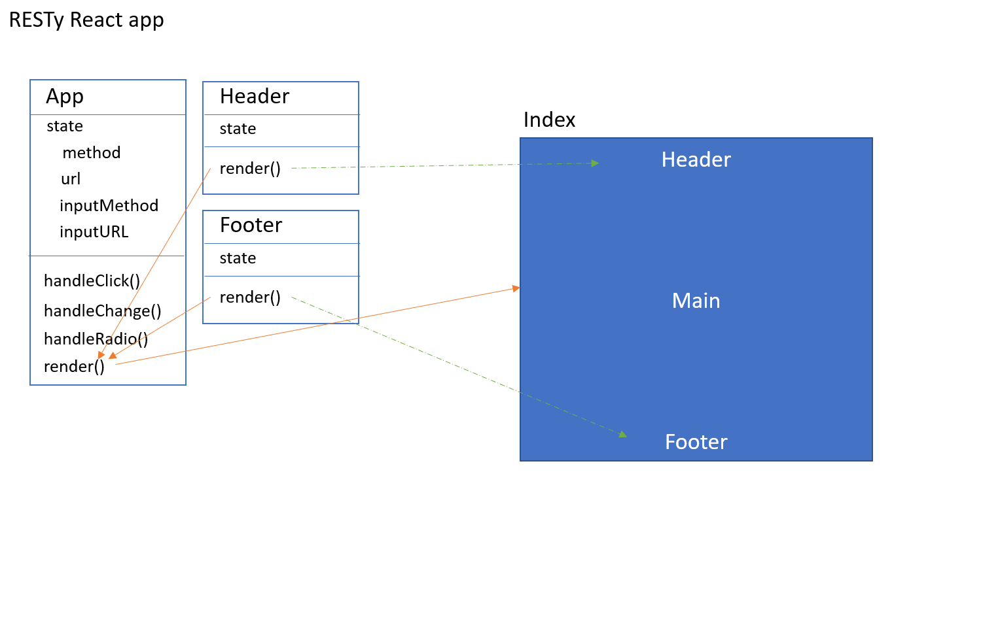

# RESTy App

This project was bootstrapped with [Create React App](https://github.com/facebook/create-react-app).

## Author

Dina Ayoub

## Usage

Run `npm start` to open the app in the browser at [http://localhost:3000](http://localhost:3000).

The page will reload if you make edits.

To test this with a REST api that allows get, post, put and delete, use my basic api server deployed on heroku:
<https://dina-basic-api-server.herokuapp.com/artists>

## Deployment

[github pages](https://dina-401-advanced-javascript.github.io/RESTy/)
[localhost](http://localhost:3000)

### UML Diagram



## Tests

- to run tests, use the command 'npm test'
- No tests available yet

## deploying in REACT

1. install gh-pages as a dependancy
2. add two scripts into the package.json

   ```json
       "predeploy": "npm run build",
       "deploy": "gh-pages -d build"
   ```

3. make a github repo
4. connect your react app to your github repo
5. run `npm run predeploy`
6. run `npm run deploy`
